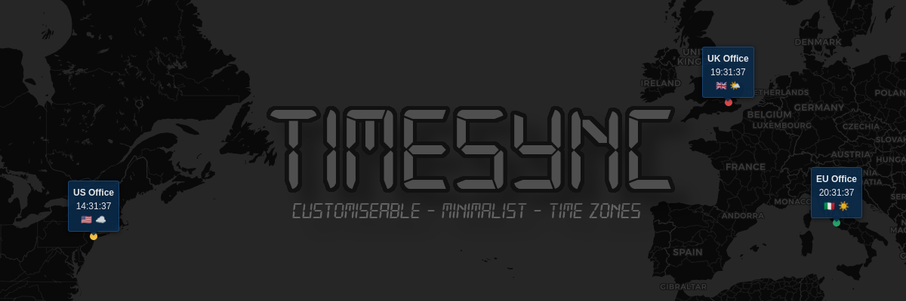

  

 

[**View Now**](https://mattravenhall.github.io/TimeSync/)

## Features ✨
- 📍 Add/remove/hide locations
- 🎨 Customise marker visuals
- 💾 Import/export locations
- 🌗 Dark/Light mode
- ☀️ Show/hide daylight

## Dev Note 🧑‍💻
This was initially vibe-coded in a couple hours because I couldn't find a minimalist customisable time zone map. Since then I've been gradually adding new features the old-fashioned way.
